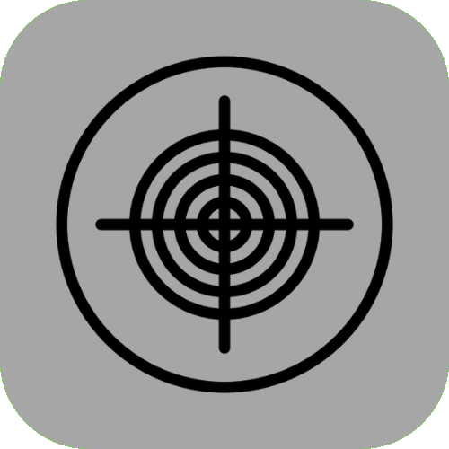

 

  

  <h3 align="center">Tech0ne</h3>

  

    Work account of <a href="https://github.com/fxndone">FoxoundOne</a>
     

  

---

## Best projects

&emsp;
&emsp;

---

## Loved languages

    &emsp;
    &emsp;
    &emsp;
    &emsp;

